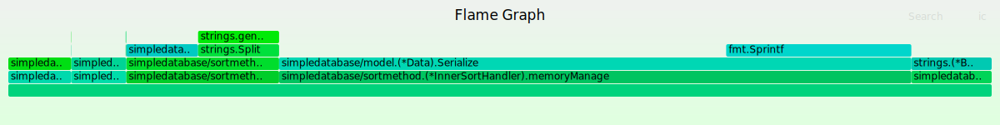

# 开发日志

### 2020-8-19
完成生成随机数据模块
完成快速排序算法模块
完成内排序
	当前内排序思想：开启多个线程 

1. 一个用于读取数据
2. 两个用于将读取的数据序列化成正常数据
3. 一个用于将正常数据添加到待排序队列
4. 一个线程监控当前`m.Alloc`当他超过设定值时，开启排序并且写入硬盘

**发现一个小问题。排序结束后并不会自动结束。**
找出原因，忘记结束`ish.memoryManage()`。解决方式：新增`finshAppendData`变量，用于记录数据是否已经读取完毕，并且存入数组。如果为真，我们对其进行最后一次排序，并结束当前程序

发现自身问题，对于内存管理的掌握不够熟练。导致出现当前问题，设定最大内存为`1GB`但每个文本写入不超过`500MB`,甚至有些只有`60MB`。
通过pprof发现，`strings.split` 以及`fmt.Sprintf`这两个函数占用了最多的内存。

明天目标，完成外排序--归并排序。以及思考并学习对内存的管理。

### 2020-8-20
开始实现外排序。
当前实现思路为 
1. 同时打开多个io，从中获取一条数据。
2. 与其他io进行比较，找到最小数据
3. 写出文件

我们对其进行简单思考，怎么样设计当前流程才能使得程序运行效率较高。我们已经知道当前程序大概的瓶颈
1. 读写速度过慢
2. 内存存储容量过小
3. `Serialize`与`UnSerialize`开销过大

问题1与问题2是无法通过程序解决。
我们只能对代码进行优化并且优化整个程序的流程

通过pprof我们发现:
`sortmethod.unserializeData`与`model.Data.Serialize`占用了大量的资源。（内存以及cpu时间）
我们暂时不对其进行优化。开始思考我们如何对程序的流程进行优化。
当前我们程序流程

1. 开启多个io
2. 从io中读取一行数据，将其反序列化
3. 存放到相应的数组元素中。 `io[0] -> data[0]`
4. 循环对比每个io。从中找到最小值
5. 取走`data[min]`，从 `io[min]`中重新读取一条补到`data[min]`中
6. 序列化`data[min]`
7. 写出到文本

我们知道序列化与反序列化为我们当前程序的瓶颈，我们如何对其提高呢

思路:

1. 保证从`io`中读取的同时，也在进行反序列化操作（将等待io时间利用到反序列化操作的时间上）
2. 为每个`io`设置缓存，当data[min]被取出时，立刻有数据填充进去
3. 由于多线程难以保证数据的有序性，所以我们暂时不对 序列化并写入文本 进行优化

**由于系统问题。在我运行归并时息屏导致当前系统出现`io-error`。所以暂时没对数据进行测试。**

### 2020-8-21
寻找以及理解，并且解决`string.Split`的效率问题以及内存占用问题

### 2020-8-23
开始优化`[]byte`与`string`之间的操作。减少导致字符串生成的操作。
发现问题`[]byte`在某些未知的情况下会发生变化。